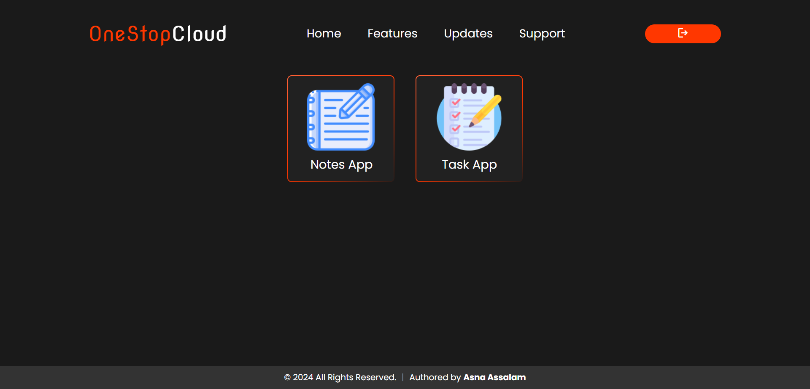
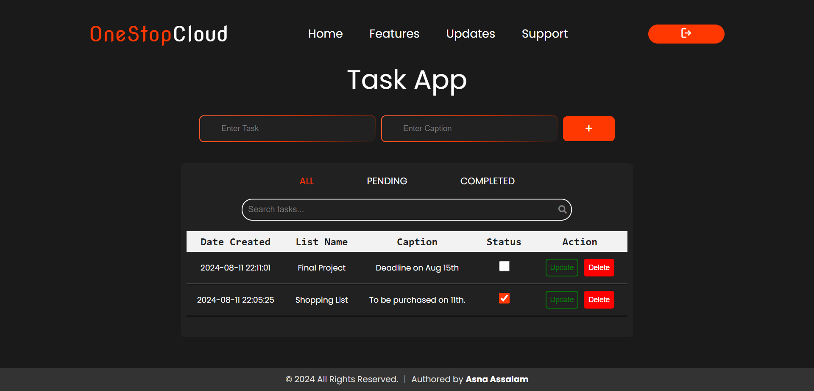
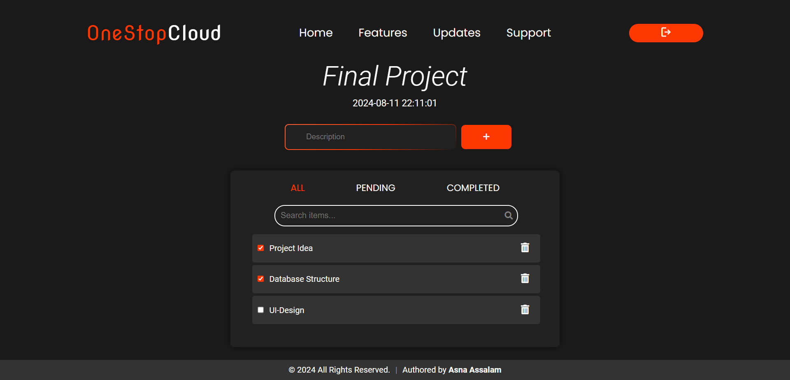
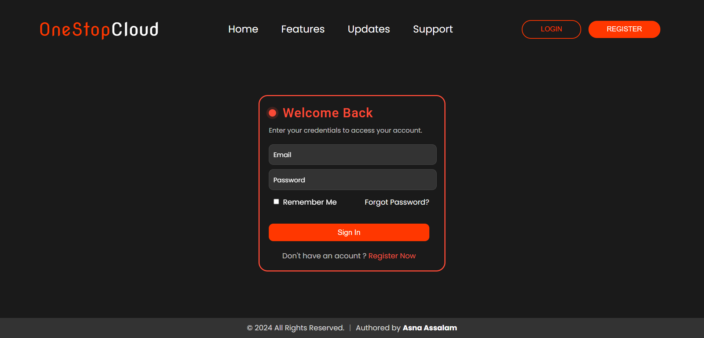

# Employee Dashboard Platform

## Description

This project is an Employee Dashboard Platform where users can register, log in, and access their personal dashboard. The dashboard includes a **Notes App** for managing notes, a **Task App** for handling tasks, and an **Item List** where items can be added under each task. An admin can log in to view registered employee details.

## Features

### User Features
- **Employee Registration and Login**: Register and log in to access the dashboard.
- **Notes App**: Create, edit, and delete personal notes.
- **Task App**: Add, edit, and delete tasks.
- **Item List**: Add items under each task for better organization.

### Admin Features
- **Admin Login**: Log in using admin credentials to access admin functionalities.
- **View Employee Details**: View the details of all registered employees.

## Technologies Used

- **HTML**: For structuring the web pages.
- **CSS**: For styling the web pages.
- **JavaScript**: For client-side interactions and dynamic updates.
- **PHP**: For server-side scripting and database interactions.

## Screenshots

### Employee Dashboard


### Notes App


### Task App


### Item List


### Login



## Getting Started

### Prerequisites

- PHP
- MySQL
- A web server (e.g., Apache or Nginx)

### Installation

1. **Clone the Repository:**
   ```bash
   git clone https://github.com/asnaassalam/employee-dashboard-platform.git
   ```

2. **Navigate to the Project Directory:**
   ```bash
   cd employee-dashboard-platform
   ```

3. **Set Up the Database:**
   - Create a new MySQL database and import the provided SQL file:
     ```bash
     mysql -u your-username -p your-database-name < database.sql
     ```

4. **Configure Database Connection:**
   - Update the database configuration in `config.php` with your database credentials.

5. **Run the Web Server:**
   - Start your web server and navigate to the project directory in your browser.

### Usage

1. **Register and Log In:**
   - Register a new employee account. Admins will manually set or provide passwords for users.
   - Log in using your email and the password set by the admin.

2. **Dashboard Features:**
   - Use the Notes App to manage your notes.
   - Utilize the Task App to manage your tasks and add items to each task.

3. **Admin Access:**
   - Log in with the admin credentials to view employee details:
     - **Admin Email:** admin@gmail.com
     - **Admin Password:** admin2024


## Acknowledgments

Special thanks to my mentor for their guidance and support throughout this project. 

Mentor: [Teran Subasinghe](https://github.com/teran-s)


